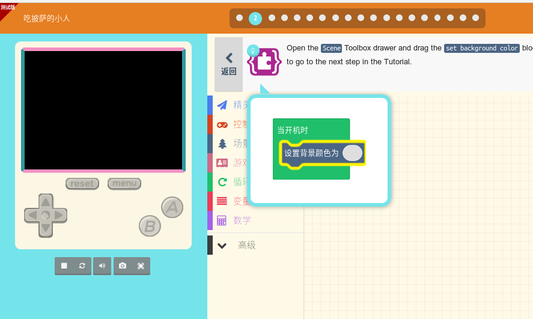
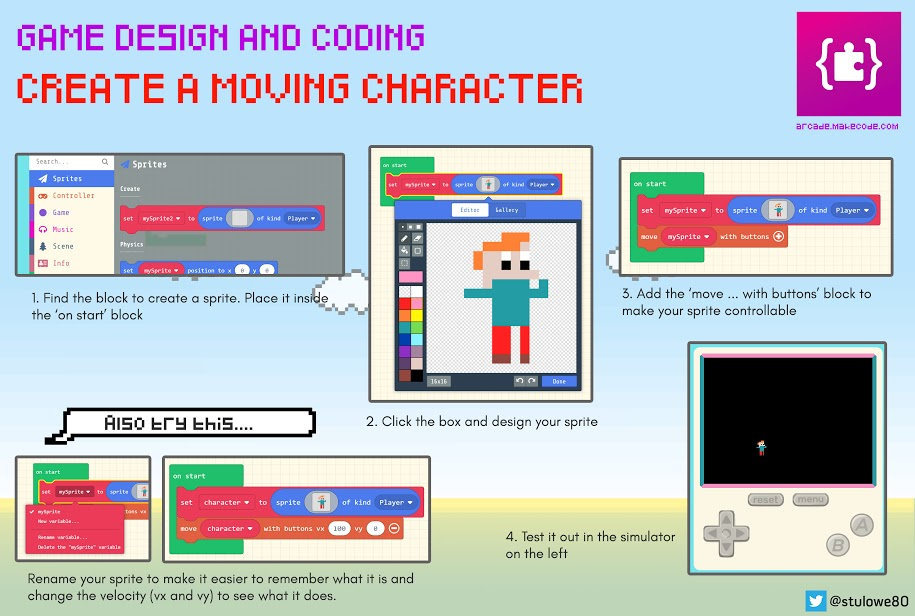

# Arcade-基于游戏的编程平台

[toc]

## Arcade

微软的Arcade是一个**基于游戏的编程平台** , 并不依赖特定的硬件.

Arcade官方 https://arcade.makecode.com/

喵比特是其中一款支持Arcade的硬件平台, 也可以直接在PC上玩. 在PC上学习制作游戏体验游戏可以受到更少的约束.

在PC/平板/手机上就可以直接玩, 无需编程经验 , 感觉用平板会比较方便..可以先在官网上体验一下别人做的游戏, 

##　使用说明

键盘方向键上下左右 代表游戏机里面的上下左右键  

键盘`Z`键, 代表游戏机的`A`键

键盘`X`键,  代表游戏机的`B`键

用鼠标电机按钮也是可以的.

## 教程

### 视频教程-官方

How to Make a Platformer Game

> 一共三节课 完成一个类似马里奥的游戏

https://www.youtube.com/playlist?list=PLMMBk9hE-SepfPK6z19t6aAfwbOQNY6K7

Bunny Hop 主题游戏搭建课程

https://www.youtube.com/watch?v=7mv43zXzJkY&list=PLMMBk9hE-Ser9FkvwxSAIxJrO13N_2hqd

### 文本教程

官方教学文档 - 计算机科学入门系列

CS INTRO 1 - CS INTRO 3 微软提供了整套的课程体系.

https://arcade.makecode.com/courses/csintro1

https://arcade.makecode.com/courses/csintro2

https://arcade.makecode.com/courses/csintro3

另外官方上也有很多交互式指导的课程

### 硬件厂商的文档

Adafruit 使用树莓派玩Aracade

https://learn.adafruit.com/how-to-make-games-on-makecode-arcade?view=all

喵比特使用文档

https://meowbit-doc.kittenbot.cn/#/

https://meowbit-doc.kittenbot.cn/#/makecode/makecode%E5%BF%AB%E9%80%9F%E5%BC%80%E5%A7%8B

## 优势 

### 逻辑简化

相比Scratch, Arcade更加的**智能** ,  一行代码就可以实现Scratch十几行或者几十行的积木块, 同样相比较Scratch要学习的概念也更少, 降低自己实现游戏的门槛. 非常适合Blockly后继的学习内容.

有很多预设定的游戏里面的属性/角色, 例如Wall墙壁, 鬼魂.  可以绘制积木, 给积木赋予对应的角色. 同时也可以设置加速度, 加速度方向.

官方的教学视频做的也很好, 虽然教程总量不多, 但是因为本身Arcade比较简单, 短短几节课足够让学生创造自己的游戏了.

大部分逻辑都可以在初始化的Loop里面完成.

### 像素风格

游戏机像素风格, 所以对小朋友的美术功底要求比较小. 很容易就可以创建自己的像素风的游戏. 动画效果也可以做的很逼真.

### 地图创建

小朋友可以绘制长条的地图,  通过设置地图(tile map)上不同的不同像素点的颜色, 映射到不同的道具/角色

相机可以让地图自动跟踪人物的位置切换画面.

### 动画

游戏中的动作, 角色的每一帧图像都可以用数组的方式进行管理. 图形化非常直观

### 游戏化驱动学习
伴随着游戏的需要, 游戏从简单到复杂, 就需要学习更多的技能. 学习起来, 有目的性
举例, 手动创建单个金币是很容易的,如果需要在地图中放置很多金币的话, 就需要使用for循环.

### 支持单步调试

单步调试， 发现自己代码中的小虫子**BUG**

## 培训/学习思路

**父母陪伴** Arcade本身是一个比较简单易用的新颖的游戏化教学平台。 但是教程比较少, 这就需要家长辅助孩子，刚开始的时候， 家长需要提前熟悉一下这套软件, 在孩子遇到困哪的时候, 可以及时协助. 
虽然Arcade是新事物, 但是图形化编程的很多概念都是想通的, 家长可能需要参阅其他的图形化编程教学体系(例如Scratch的), 了解基本的计算机科学的基础知识.

**重复训练与知识迁移** 同样的功能, 例如for循环, 又例如碰撞检测等功能. 需要创建应用场景, 让小朋友重复的练习.  首先是跟着教程做，能够做同样的游戏出来.
然后将游戏常见的功能要素, 剥离出来, 创建自己的**知识仓库/技能包**
可以让爸爸辅助，让孩子玩游戏做好笔记, 就像会收纳自己的玩具一样. 
然后父母观察/询问孩子喜欢玩什么小游戏(例如4399)？ 然后，带领孩子拆解游戏, 看这个游戏里面功能都映射到哪些知识点上。 对于孩子已经掌握的技能(可能已经重复好多次了, 例如射击) 让孩子自主的去完成, 强化记忆. 
对于未出现的功能, 家长需要 提前了解这个新的功能都对应着哪些**新的知识点**, 提前做好知识储备. 

另外Arcade还提供了**Coding Card**， 可以彩印出来. 将技能浓缩在一张卡片上.

> 更多的coding card 见官网 https://arcade.makecode.com/

**群体学习**  可以由爸爸们牵头, 周末搞一些workshop, 聚在一起.
分工协作, 亲子/小朋友门一同从提出一个游戏构想开始, 设计游戏规则, 然后项目拆解逐步完成.  最后，为了让孩子有成就感, 可以做一个展示，邀请别人试玩自己的游戏。 也可以锻炼孩子的表达能力, 在孩子掌握该技能之后, 教其他小朋友做自己的游戏.  

## 潜在的挑战

1. Arcade是今年新推出的，现在的都还是测试版,
2. 输入决定输出, 如果没有足够多的参考例程, 在实现的时候会遇到一些瓶颈 . 需要对社区的游戏进行筛选.
3. 官方提供的视频课程，用了三节课的时间讲完Arcade游戏制作, 内容密度比较大. 可以适当拆分, 一次学几个知识点. 增加课时。
4. 语言, 教程都是英语的，存在一定的语言障碍.

## 我的世界-主题游戏化课程

> 单纯从学编程的角度， 我还是比较推荐Arcade.
> 

学会编程是为了应用, 用编程的方法玩游戏获取是不错的训练途经. 用编程的方法创建积木.
Microsoft的官方Youtube 介绍视频 [Minecraft Code Builder](https://www.youtube.com/playlist?list=PLMMBk9hE-Serm1gkooPSYGMOaGkGjMZq2)

https://www.youtube.com/watch?v=mnqj551lwBU&list=PLMMBk9hE-Serm1gkooPSYGMOaGkGjMZq2

https://education.minecraft.net/class-resources/trainings/

使用MineCraft 教授艺术,科学, 历史， 文化, 计算机科学, 数学, 设计.
https://education.minecraft.net/class-resources/lessons/

编程一小时《我的世界》教程
https://code.org/minecraft

