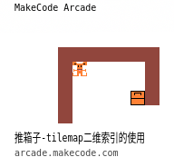
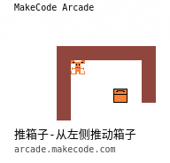
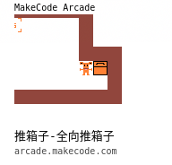
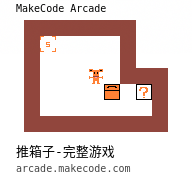

# 推箱子

[toc]

## 推箱子-通过按键控制小人移动

[效果视频](https://www.bilibili.com/video/av82551127?p=9)

## 推箱子-tilemap二维索引的使用

[效果视频](https://www.bilibili.com/video/av82551127?p=10)

## 推箱子-从左侧推动箱子

[效果视频](https://www.bilibili.com/video/av82551127?p=11)

## 推箱子-全向推箱子

[效果视频](https://www.bilibili.com/video/av82551127?p=12)

## 推箱子-完整游戏

