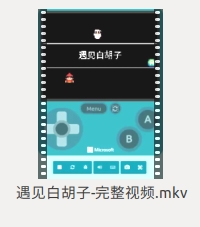
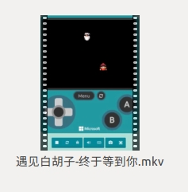
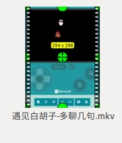
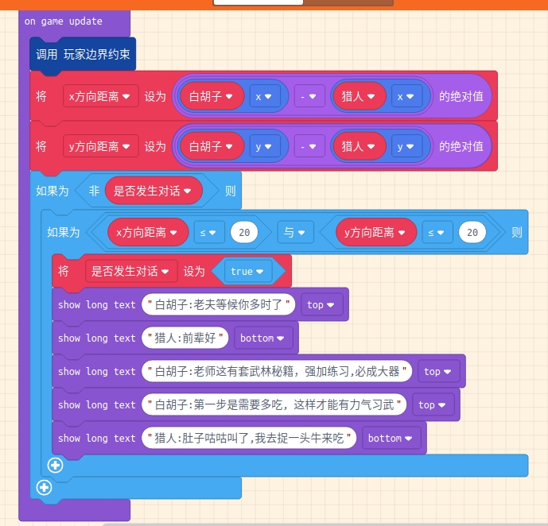
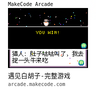

# 遇见白胡子-他有话对我说

[toc]

## 效果视频

[效果视频-遇见白胡子-完整版](https://www.bilibili.com/video/av82551127?p=5)

## 计算直线距离-白胡子说话

* 创建一个白胡子精灵

* **splash对话框** 显示游戏标题 

  按键A按下

* 创建两个变量, 一个叫`x方向距离`, 另外一个叫`y方向距离`

* 绝对值abs 　距离计算

* 复合逻辑语句 **与**  + if语句

  判断x方向与y方向距离都小于特定范围的时候 

* 当猎人进入到白胡子的矩形区域内, 让角色开始说话 Say 终于遇到你

[效果视频-遇见白胡子-终于等到你](https://www.bilibili.com/video/av82551127?p=3)

## 使用对话框-多聊几句

* 其实可以多聊几句

  对话框序列 

* 聊到最后,  告诉你下一步的任务.

* 测试发现重复执行-> 怎么才能只执行依次.? 

  通过设置标志位, 判断事件是否已经发生.

[效果视频-遇见白胡子-多聊几句](https://www.bilibili.com/video/av82551127?p=4)

## 游戏终止判断

* 终止游戏-完成任务

* 添加按键音

  每次按键A按下的时候, 都播放一段音乐

效果视频

[效果视频-遇见白胡子-完整版](https://www.bilibili.com/video/av82551127?p=5)

