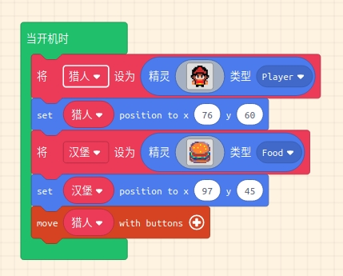
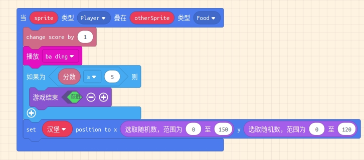
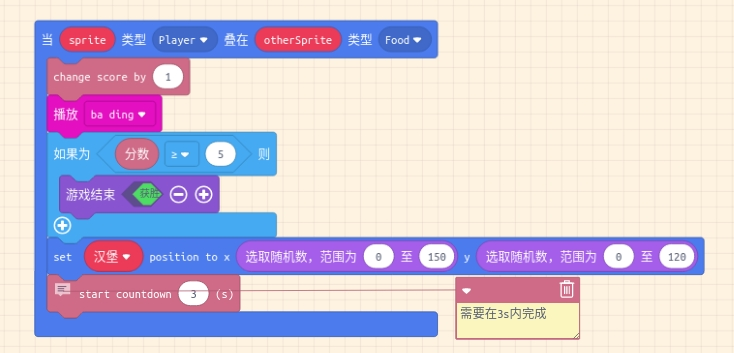

# 大胃王猎人-吃汉堡

[toc]

## 效果视频

为了保持体力需要持续的吃东西, 猎人最喜欢吃的食物就是汉堡了.

[效果视频-大胃王猎人-吃汉堡](https://www.bilibili.com/video/av82551127?p=6)

## 创建食物精灵

* 添加食物

  Arcade角色-食物

* 绘制食物/选择食物  

  汉堡

* 玩家吃食物检测- 设置Overlaps重叠处理函数 

* 系统信息`Info` -修改并显示分数

  在INFO处, 拖动`change score by ?`积木

  系统广播，添加到Overlap处理函数里面

* 食物计分与数值更新

* 食物被吃掉之后,  随机制定新的食物的位置

* **随机数** 模块, 随机初始化食物的位置.

  > 什么是随机数? 举例: 筛子, 抓阄

* 吃东西的时候就要发出响声, 添加音效

> 参考游戏案例: 吃披萨的小人

效果视频: 

* 作业- 在这个游戏里面实现根据速度切换猎人的形象的功能

  实现之前学的知识点.

## 添加计分与倒计时

* 设置能量格(分数), 吃一个牛肉就加一个能量
* 加满5个能量完成游戏

* 设置倒计时

效果视频

[效果视频-大胃王猎人-吃汉堡](https://www.bilibili.com/video/av82551127?p=6)

