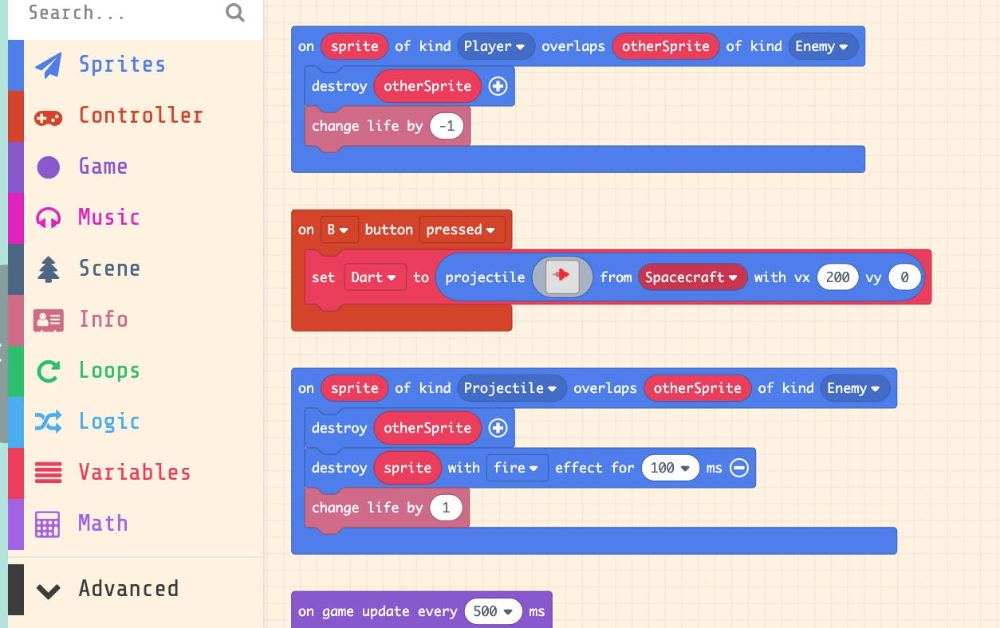
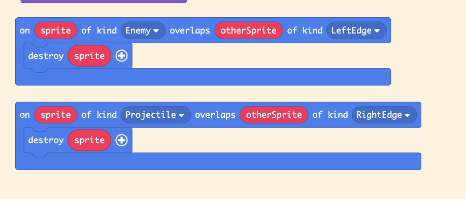

# Max的Arcade学习问题汇总

## Galga的导出MiaoBit后，玩了一阵子出现速度变慢以及Screen Frozen。

### 问题现象

- 模拟器使用正常
- 导出过程正常
- 游戏玩一阵子以后，出现速度变慢，而且屏幕停滞的情况

### 问题分析

- Sprite Player 发射的Projectile Darts，如果没有击中Sprite Bogey，就会飞出右边边界，但是Darts没有被Destroied；
- 随机产生的Sprite Bogeys，如果没有击中Sprite Player，也会飞出左边的边界，但是Bogeys没有被Destroied；
- 以上两项Sprites累计占用内存，造成系统卡顿。

### 问题解决

- 增加边界设置
- 增加飞出边界的Sprites的摧毁处理；

