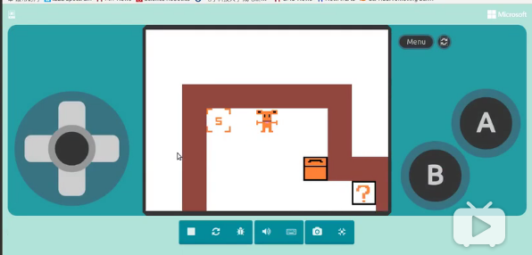

# Arcade图形化编程-游戏开发

[toc]

## 前言
微软MakeCode出品的Arcade编程平台.
本仓库是Arcade的开源游戏教学案例, 老师们可以随意使用. 希望给大/小朋友们带来欢乐, 喜欢记得点赞哦, 也希望更多的朋友可以和我一起完善这套开源课件.

## 效果视频

[微软MakeCode Arcade图形化编程-游戏制作效果视频](https://www.bilibili.com/video/av82551127)

## 目录

1. [Arcade-基于游戏的编程平台](1.Arcade-基于游戏的编程平台/Arcade-基于游戏的编程平台.md)
3. [创建自己的英雄-你是一个猎人](3.创建自己的英雄-你是一个猎人/创建自己的英雄-你是一个猎人.md)
4. [根据速度切换猎人的图像](4.根据速度切换猎人的图像/根据速度切换猎人的图像.md)
5. [约束猎人的运动范围](5.约束猎人的运动范围/约束猎人的运动范围.md)
6. [遇见白胡子-他有话对我说](6.遇见白胡子-他有话对我说/遇见白胡子-他有话对我说.md)
7. [大胃王猎人-吃汉堡](7.大胃王猎人-吃汉堡/大胃王猎人-吃汉堡.md)
8. [出门打猎-弓箭射击](8.出门打猎-弓箭射击/出门打猎-弓箭射击.md)
9. [MAX的火星探测器着陆](9.MAX的火星探测器着陆/MAX的火星探测器着陆.md)
10. [赛车小游戏](10.赛车小游戏/赛车小游戏.md)
11. [MAX的迷宫小车](11.MAX的迷宫小车/MAX的迷宫小车.md)
12. [推箱子](12.推箱子/推箱子.md)

## 关于作者

阿凯, 小花, MAX小朋友

微信: xingshunkai | Email: xingshunkai@qq.com

